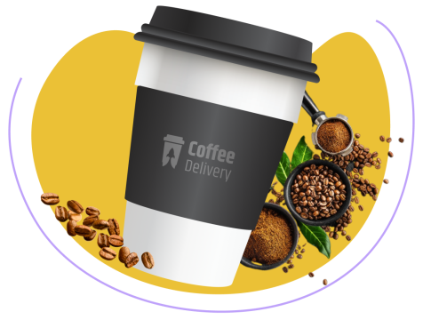
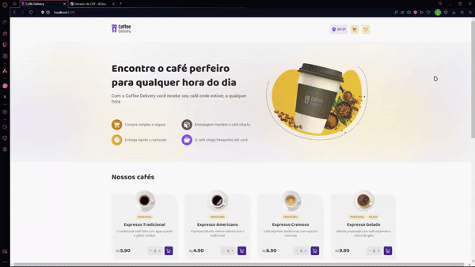

<h1 align="center">
    
</h1>

<h4 align="center"> 
	🚀Ignite React  
</h4>

    
 
  

  <a href="#technologies">Technologies</a>&nbsp;&nbsp;&nbsp;|&nbsp;&nbsp;&nbsp;
  <a href="#information">About</a>&nbsp;&nbsp;&nbsp;

## ✏ About

Coffee Delivery é uma página web de catalogo e compra de cafés pela [RocketSeat]

[Figma](<https://www.figma.com/file/s32nTQjEeAtCNllepq1K05/Coffee-Delivery-•-Desafio-React-(Copy)?type=design&node-id=222-564&mode=design&t=XObhjiCtj8Cejful-0>)

<h1 align="center">
     
</h1>

## 🛠 Technologies and Libs:

the following technologies and libs:

- [React + Vite]
- [Typescript]
- [Styled Components]
- [Phosphor Icons]

Made with ♥ by Whey :wave: [Get in touch!](https://www.linkedin.com/in/wheyckson-lopes/)
